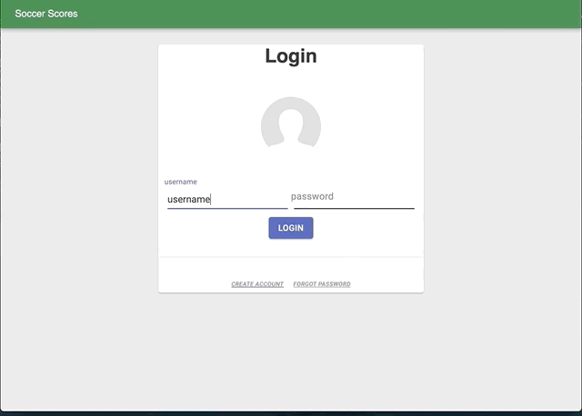
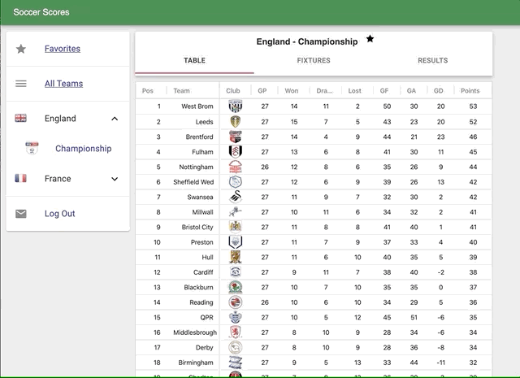
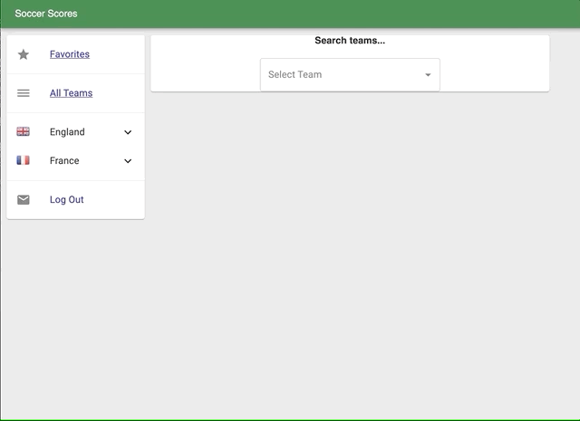
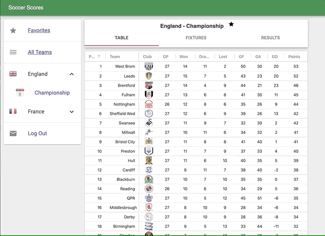

# SoccerScores
This is a full stack web app for viewing football scores, fixtures and results.

## Frontend
#### React - javascript, html, css

    https://github.com/ollieloney95/SoccerScores/tree/master/react-frontend

## Backend
#### Python Flask web service

    https://github.com/ollieloney95/SoccerScores/tree/master/python-flask-bckend

## Overview
#### full stack login system

#### tables

#### favorites

#### match views

